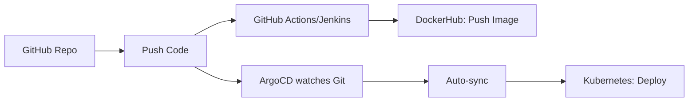

# Flask CI/CD Demo with GitHub, Jenkins, DockerHub, ArgoCD & GitOps

This project demonstrates a **CI/CD pipeline using GitHub + Jenkins + DockerHub + ArgoCD**, powered by **Helm** and **GitOps** best practices.

---

## 🔧 Tech Stack

- 🐙 **GitHub** – Source of truth (GitOps)
- 🧪 **GitHub Actions / Jenkins** – Continuous Integration (CI)
- 🐳 **DockerHub** – Container registry
- 🚢 **ArgoCD** – Continuous Delivery (CD) to Kubernetes
- ☸️ **Kubernetes** – Target deployment platform
- 📦 **Helm** – Deployment packaging
- 🏷️ **GitHub Tag Action** – Auto-tagging versions
- 🔔 **Slack Action** – Notifications

---

## ⚙️ CI/CD Workflow



> ✅ ArgoCD automatically detects changes in Git (e.g., Docker tag updates via CI) and deploys them to the cluster.

---

## 🔁 GitOps Workflow (Visual)


---

## 📁 Folder Structure

```bash
.
├── app/                     # Flask application
├── helm/                    # Helm chart for K8s deployment
├── .github/workflows/       # GitHub Actions CI/CD workflows
│   ├── docker-build.yaml
│   └── autotag.yaml
├── jenkinsfile              # Jenkins pipeline (optional)
├── argocd-app.yaml          # ArgoCD Application definition
├── Dockerfile
├── requirements.txt
└── README.md
```

---

## 🪝 GitHub Secrets Required

| Secret Name          | Used In              | Description                          |
|----------------------|----------------------|--------------------------------------|
| `DOCKERHUB_USERNAME` | GitHub Actions        | DockerHub login                      |
| `DOCKERHUB_TOKEN`    | GitHub Actions        | DockerHub access token               |
| `SLACK_WEBHOOK_URL`  | GitHub Actions        | Slack channel notification webhook   |

---

## 🚀 ArgoCD Setup

To deploy via ArgoCD:

```bash
kubectl apply -f argocd-app.yaml
```

ArgoCD will auto-sync the `helm/` chart to your cluster when you push changes.

---

## ✅ Features

- [x] Build & Push Docker image (GitHub Actions or Jenkins)
- [x] Auto-tag version based on commits
- [x] Slack notifications for build status
- [x] Helm chart packaging
- [x] ArgoCD GitOps delivery
- [x] GitHub-based GitOps workflow

---

## 📌 Manual Setup

1. Push this repo to GitHub.
2. Set GitHub secrets (DockerHub, Slack).
3. Install ArgoCD in your cluster.
4. Apply `argocd-app.yaml` to register this app.
5. Trigger a push to start CI + auto-sync.

---

## 🤝 Contributing

PRs welcome. You can fork, extend to GitHub Container Registry, or integrate Vault for secret management.

---

## 📜 License

MIT
